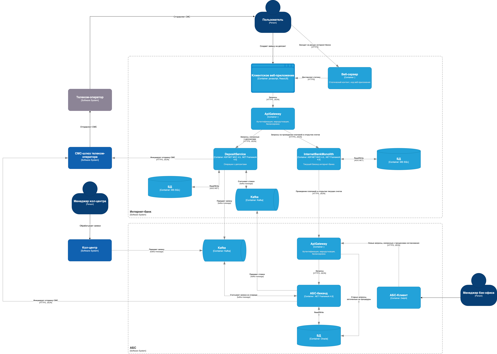

### **Название задачи:** Открытие депозита 
### **Автор:** Ригин А.А
### **Дата:** 05.06.2025
### **Функциональные требования**

| **№** | **Действующие лица или системы**                                            | **Use Case**                                 | **Описание**                                                                                                                                                                                                                                                                                                                                                                                                                                                                                                                                                              |
|-------|-----------------------------------------------------------------------------|----------------------------------------------|---------------------------------------------------------------------------------------------------------------------------------------------------------------------------------------------------------------------------------------------------------------------------------------------------------------------------------------------------------------------------------------------------------------------------------------------------------------------------------------------------------------------------------------------------------------------------|
| 1     | Клиент, веб-сервер, с-ма кол-центра                                         | Подача заявки на депозит через сайт          | - Клиент заходит на сайт банка - Клиент просматривает список доступных депозитов с актуальными ставками. - Клиент заполняет форму заявки (ФИО, номер телефона). - Система сохраняет заявку и передает заявку в кол-центр.                                                                                                                                                                                                                                                                                                                                                |
| 2     | Клиент, бекенд интернет-банка, с-ма кол-центра, шлюз телеком-оператора, АБС | Подача заявки на депозит через интернет-банк | - Клиент авторизуется в интернет-банке. - Клиент просматривает список депозитов с актуальными и персонализированными ставками. - Клиент выбирает тип депозита, указывает сумму и счет. - Бекенд интернет-банка иницирует отправку СМС с кодом подтверждения через шлюз смс-шлюз телеком-оператора - Клиент вводит код подтверждения. - Бекенд интернет-банка сохраняет заявку и передает ее в АБС. - Бекенд интернет-банка иницирует отправку СМС с уведомлением о принятии заявки через шлюз смс-шлюз телеком-оператора - Клиент получает уведомление о принятии заявки. |
| 3     | Клиент, менеджер кол-центра, АБС                                            | Обработка заявки менеджером кол-центра       | - Менеджер просматривает список активных заявок в с-ме кол-центра - Менеджер открывает одну из заявок - Менеджер проверяет данные клиента (ФИО, номер телефона) и запрашивает персонализированные ставки из АБС (если клиент уже есть в системе). - Менеджер связывается с клиентом и предлагает условия депозита. - Если клиент согласен, менеджер направляет его в отделение для идентификации.                                                                                                                                                                         |
| 4     | Сотрудник бэк-оФиса, АБС, клиент, смс-шлюз                                  | Обработка заявки бэк-офисом в АБС            | - Бэк-офис в АБС просматривает активные заявки - Сотрудник проверяет данные (счет, сумму, тип депозита). - Сотрудник согласовывает ставку и подтверждает открытие депозита - АБС открывает депозит.  - АБС иницирует отправку СМС-уведомления об открытии депозита (через смс-шлюз телеком оператора). - Клиент получает СМС-уведомление об открытии депозита.                                                                                                                                                                                                            |

### **Нефункциональные требования**

| **Код** | **Нуфункциональные требования**           | ****                                                                                                                                                                                        | **Комментарий**                                                                                                                                                                                                                                           |
|---------|-------------------------------------------|---------------------------------------------------------------------------------------------------------------------------------------------------------------------------------------------|-----------------------------------------------------------------------------------------------------------------------------------------------------------------------------------------------------------------------------------------------------------|
| **R**   | Надёжность (Reliability)                  |                                                                                                                                                                                             |                                                                                                                                                                                                                                                           |
| **R1**  | -                                         | Все сервисы должны работать 24/7 и быть доступны в 99,9% случаев                                                                                                                            |                                                                                                                                                                                                                                                           |
| **R2**  | -                                         | В случае сбоев в ЦОД необходимо, чтобы сервисы интернет-банка были доступны и выдерживали требуемую нагрузку. В случае сбоя можно переключиться на резервный ЦОД                            |                                                                                                                                                                                                                                                           |
| **P**   | Производительность (Performance)          |                                                                                                                                                                                             |                                                                                                                                                                                                                                                           |
| **P1**  | -                                         | Отклик по всем операциям должен быть максимально быстрым и занимать миллисекунды                                                                                                            | Сейчас с этим есть проблема:  - при проведении платежей некоторые справочные данные загружаются больше секунды;  - база АБС сильно перегружена  - Онлайн-подача заявок на большое количество продуктов может поставить под угрозу работоспособность банка |
| **P2**  | -                                         | Нужно предусмотреть равномерное горизонтальное масштабирование и распределение запросов между серверами, приложениями и ЦОД.                                                                | См. F6                                                                                                                                                                                                                                                    |
| **+R**  | + Ограничения (Restrictions)              |                                                                                                                                                                                             |                                                                                                                                                                                                                                                           |
| **R1**  | Общие ограничения                         |                                                                                                                                                                                             |                                                                                                                                                                                                                                                           |
| **R11** | -                                         | Функционал открытия депозитов можно выделить в отдельный сервис                                                                                                                             | Стоит ли это делать в рамках mvp? Нужно обсудить.                                                                                                                                                                                                         |
| **R2**  | Требования к технологиям                  |                                                                                                                                                                                             |                                                                                                                                                                                                                                                           |
| **R21** | -                                         | При доработках во всех системах нужно использовать технологии, которые уже есть в банке.                                                                                                    | См. описание IT-ландшафта компании                                                                                                                                                                                                                        |
| **R22** | -                                         | Использование новых технологий допускается, но необходимо, чтобы они были совместимы с существующими платформами разработки.                                                                | См. R4                                                                                                                                                                                                                                                    |
| **R23** | -                                         | Необходимо использовать kafka в качестве очереди сообщений                                                                                                                                  |                                                                                                                                                                                                                                                           |
                                                                                                                                                                                                                                                    |

### **Решение**

Диаграмма контекста

Диаграмма контейнеров

Обоснование:

I Есть следующие требования:
1) Интернет-банк должен отправлять в АБС заявки на депозиты. 
2) Интернет-банк должен каким-то образом получать персонализированные ставки из АБС, чтобы была возможность показывать их пользователям.
3) Система кол-центра должна передавать в АБС заявки (явно об этом не говорится. сказано только, что "После звонка новому клиенту надо прийти в отделение для идентификации". Кажется, что если клиент согласен, то было бы неплохо создать соответствующую заявку в АБС)

Известно, что система АБС (база) очень сильно перегружена. При этом, к системе предъявляются высокие требования по доступности и производительности, а возможности масштабирования весьма ограничены.
В связи с этим были приняты следующие решения:
1. Для передачи заявок из интернет банка и кол-центра в АБС использовать kafka. Kafka позволит АБС равномерно обрабатывать поток заявок с учетом своей нагрузки, повысит надежность и т.д.
2. Логику по работе с депозитами вынести в отдельный сервис, поскольку текущий бекенд, как было сказано в требованиях, "не совместим" с kafka. 
3. Для передачи актуальных ставок из АБС в интернет банк также планируется использовать kafka по тем же причинам. АБС сильно перегружена, поэтому вариант, при котором Интернет-банк будет синхронно (через REST API, например) обращаться в АБС, может "положить" с-му

II Соображения по поводу системы АБС:

Известно, что сейчас основная логика реализована на PL-SQL процедурах. Более того, интернет банк проинтегрирован напрямую с БД
В рамках MVP Есть требование, что в АБС необходимо вести учет ставок и реализовать процесс согласования ставок (возможно, для MVP это излишне)
Также необходимо отправлять СМС клиенту.

Подход с реализацией логики на PL-SQL страдает следующими проблемами:
- высокая сложность разработки и поддержки. код трудночитаем, сложно тестировать
- проблемы с производительностью. вся бизнес-логика выполняется внутр СУБД.
- и т.д.

Подход, при котором бекенд интернет-банка напрямую общается к БД, является небезопасным и негибким.

Учитывая указанные проблемы, были приняты следующие решения:
1. Новую логику (учет ставок, процесс согласования, отправку смс) выносим в отдельный сервис "АБС Backend". Дальнейшую разработку процедур в БД считаем нецелесообразной.
2. текущую логику, реализованную на PL-SQL процедурах, оставляем, но в следующих итерациях будем от нее избавляться. 
3. запрещаем интернет-банку напрямую взаимодействовать с БД АБС-системы. интернет-банк должен будет взаимодействовать с АБС через соответствующий ApiGateway. можно реализовать после mvp.
4. на уровне клиента тоже имеется логика, которая обращается в БД напрямую. клиент также должен будет взаимодействать с БД через ApiGateway. можно реализовать после mvp.

### **Альтернативы**

Можно использовать REST API + кэширование вместо Kafka для передачи заявок.
Kafka добавляет сложность, а REST API проще для команды.
Можно снизить нагрузку на АБС за счёт кеширования (Redis).

Плюсы:
- меньше новых технологий, в банке уже есть экспертиза по REST
- меньше затрат по инфраструктуре, поскольку не нужны брокеры сообщений и т.д.

Минусы:
- синхронные вызовы могут привести к перегрузке АБС при скачке нагрузке
– если АБС упадет, то интернет-банк не сможет передать заявку. на стороне интернет-банка придется реализовывать механизм ретраев и т.д.

**Недостатки, ограничения, риски**

1. Использование kafka: 
- Kafka требует дополнительных ресурсов для настройки и поддержки. Если у разработчиков нет опыта работы с kafka, то увеличатся временные затраты на разработку.
- Асинхронная обработка через Kafka может привести к задержкам в обновлении заявок.

2. Выделение сервиса «АБС Backend»
- Параллельная поддержка старой (PL/SQL) и новой логики увеличит нагрузку на команду.
- Перенос логики из Oracle-процедур в микросервис может выявить скрытые зависимости.