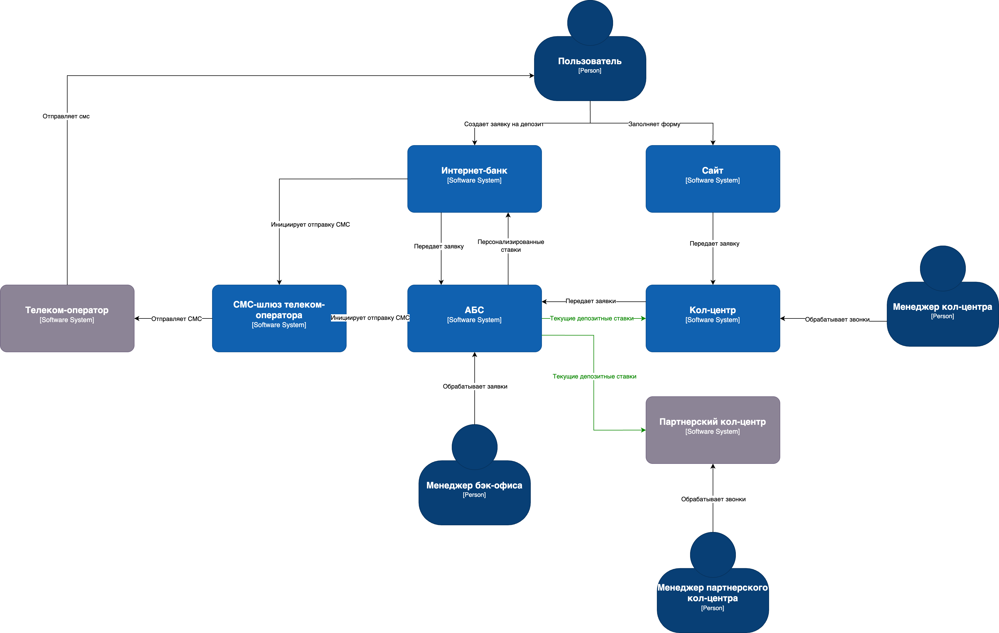
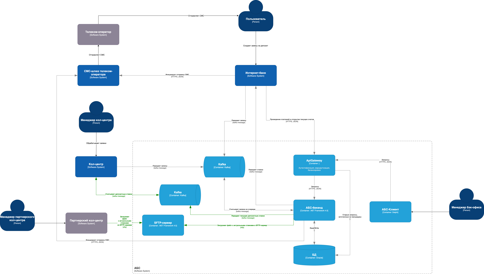

### **Название задачи:** Передача ставок в кол-центр
### **Автор:** Ригин А.А.
### **Дата:** 08.06.2025
### **Функциональные требования**
Опишите здесь верхнеуровневые Use Cases. Их нужно оформить в виде таблицы с пошаговым описанием:

| **№** | **Действующие лица или системы**                  | **Use Case**                                                         | **Описание**                                                                                                                                                                                                                                                                   |
| - | --------------------------------------------- | ---------------------------------------------------------------- | -------------------------------------------------------------------------------------------------------------------------------------------------------------------------------------------------------------------------------------------------------------------------- |
| 1 | АБС, внутренний кол-центр, менеджер бэкофиса  | Обмен актуальными депозитными ставками с внутренним кол-центром  | – менеджер бэкофиса обновил ставки – АБС отправляет сообщение с изменениями в kafka – внутренний кол-центр считывает сообщения из кафки и применяет изменения                                                                                                        |
| 2 | АБС, партнерский кол-центр, менеджер бэкофиса | Обмен актуальными депозитными ставками с партнерским кол-центром | – менеджер бэкофиса обновил ставки – АБС формирует файл rates.json, содержащий актуальные ставки – АБС загружает файл на SFTP-сервер – Партнерский кол-центр забирает файл с SFTP-сервера (по расписанию) – Партнерский кол-центр импортирует загруженный файл |

### **Нефункциональные требования**

| **Код** | **Нуфункциональные требования**  | ****                                                                                                         | **Комментарий**  |
|---------|----------------------------------|--------------------------------------------------------------------------------------------------------------|------------------|
| **P**   | Производительность (Performance) |                                                                                                              |                  |
| **P3**  | -                                | Нужно подключить к работе партнерский кол-центр, чтобы снять часть нагрузки                                  |                  |
| **+R**  | + Ограничения (Restrictions)     |                                                                                                              |                  |
| **R1**  | Общие ограничения                |                                                                                                              |                  |
| **R12** | -                                | решение должно быть сделано на основе текущего процесса работы со ставками                                   |                  |
| **R13** |                                  | партнерский кол-центр готов получать новые ставки в виде файлов. Кол-центр не сможет использовать api-вызовы |                  |

### **Решение**

Диаграмма контекста

Диаграмма контейнеров

Обоснование:

I. kafka для передачи актуальных ставок во внутренний кол-центр.
Использование kafka обусловлено теми же причинами, что и при отправке заявок в предыдущем задании (task3). В основном чтобы не перегружать систему АБС.

II. Передача файлов во внешний кол-центр

Партнерский кол-центр может работать только с файлами (не API)
С точки зрения доработок на стороне АБС потребуется минимум усилий.

### **Альтернативы**

**1. Унифицированное взаимодествие для всех кол-центров (через API или kafka)**

Плюсы:
- единое решение для интеграции всех систем. меньше кода для поддержки.
- оперативное обновление ставок

Минусы:
- yе соответствует текущим ограничениям партнёрского кол-центра (нет возможности работать с API)
- требуется больше доработок на стороне АБС

Возможно, применимо в будущем, если партнер будет готов модернизировать свою систему.

**2. Email-рассылка файлов**

Автоматическая отправка файлов со ставками на email-почтку партнера.

Плюсы:
- Простота реализации (не требует SFTP-сервера)

Минусы:
- Ненадёжность 
- Ручная загрузка (риск человеческих ошибок)
- неоперативное обновление данных

**Недостатки, ограничения, риски**

Kafka:
- аналогично предыдущему заданию

SFTP-сервер:
- задержки данных. Ставки обновляются не в реальном времени, а по расписанию (например, раз в час)
- клиенты могут получать устаревшую информацию